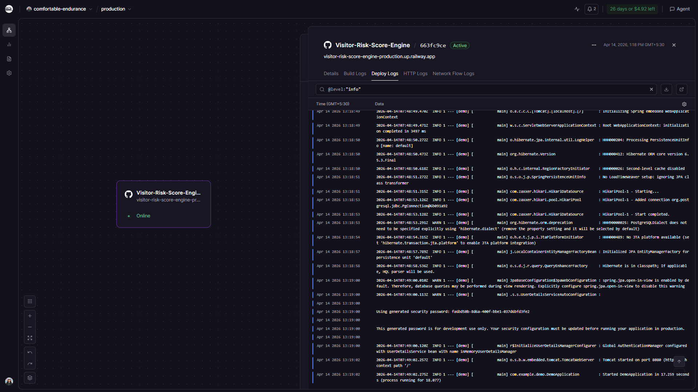
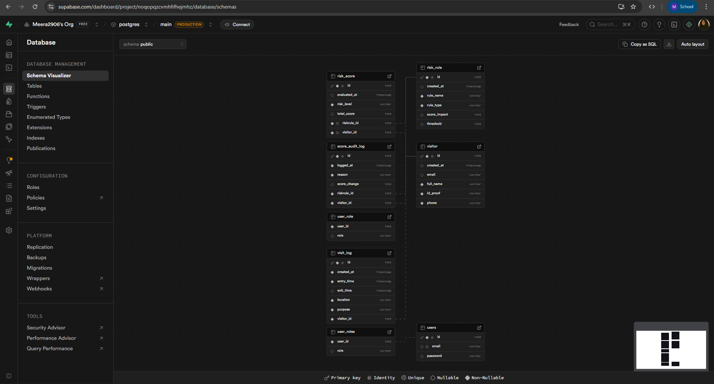
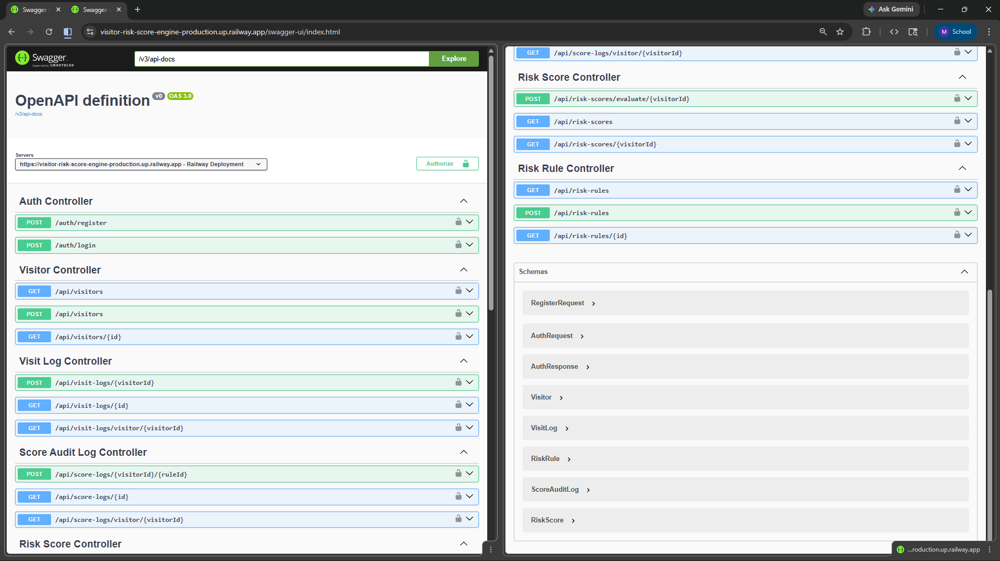

# 🛡️ Visitor Risk Scoring Engine

A **production-ready Spring Boot backend system** for evaluating visitor risk using configurable rules, secure authentication, and role-based authorization.

---

## 🌐 Live Deployment

The application is deployed on **Render** and backed by **PostgreSQL**.

🔗 **Base URL**: https://visitor-risk-score-engine-production.up.railway.app
🔗 **Swagger UI**: https://visitor-risk-score-engine-production.up.railway.app/swagger-ui/index.html

---

## 📌 Overview

The **Visitor Risk Scoring Engine** helps organizations **assess and manage visitor risk in a structured, rule-driven manner**.

Instead of relying on subjective judgment, the system evaluates visitors based on:
- **Admin-defined risk rules**
- **Recorded visitor activity and visit logs**

Each visitor is assigned a **cumulative risk score**, enabling informed decisions and consistent enforcement of security policies.

The system uses **JWT-based authentication** and **role-based authorization** to ensure secure access to critical operations.

---

## 🎯 Key Features

- 🔐 **JWT-based Authentication & Authorization**
- 👥 **Role-Based Access Control**
  - **ADMIN**: Create and manage risk rules
  - **STAFF**: Register visitors and record visit logs
- 📊 **Rule-driven Risk Scoring Engine**
- 🧩 **Clean Layered Architecture**
- 🛠️ **RESTful APIs**
- 🗄️ **PostgreSQL-backed persistence using JPA & Hibernate**
- 📖 **Swagger / OpenAPI documentation**

---

## 🧑‍💻 Tech Stack

- **Java 17**
- **Spring Boot**
- **Spring Security**
- **JWT (JSON Web Tokens)**
- **Spring Data JPA**
- **Hibernate**
- **PostgreSQL**
- **Maven**
- **Swagger / OpenAPI**
- **Render (Deployment)**

---

## 🏗️ Architecture

The project follows a **clean layered architecture**:

```

Controller  →  Service  →  Repository  →  Database
↓
Security (JWT, Roles)

````

### Layers

- **Controller Layer** – Handles HTTP requests and responses  
- **Service Layer** – Business logic and validations  
- **Repository Layer** – Database access using JPA  
- **Security Layer** – JWT validation and role-based authorization  

---

## 🔐 Security Design

- Users authenticate via login to receive a **JWT token**
- The token contains:
  - User ID
  - Email
  - Assigned roles (ADMIN / STAFF)
- A custom **JWT Authentication Filter** validates the token on every request
- Access control is enforced using **`@PreAuthorize` annotations**

Example:

```java
@PreAuthorize("hasRole('ADMIN')")
@PostMapping("/risk-rules")
public RiskRule createRule(...) { }
````

---

## 👤 Roles & Permissions

| Role  | Permissions                           |
| ----- | ------------------------------------- |
| ADMIN | Create, update, and delete risk rules |
| STAFF | Add visitor profiles and visit logs   |
| BOTH  | View permitted resources              |

---

## 📂 Core Modules

* **Authentication**

  * Login and JWT token generation
* **Visitor Management**

  * Create visitor profiles
  * Record visit logs
* **Risk Rule Management**

  * Define thresholds and score impact
* **Risk Evaluation**

  * Calculate cumulative risk score per visitor

---

## 📸 Screenshots

### Railway Deployment


### PostgreSQL Database Tables


### Swagger API Documentation


---

## ▶️ Running the Project Locally

### 1️⃣ Clone the repository

```bash
git clone https://github.com/Meera2906/Visitor-Risk-Score-Engine.git
cd Visitor-Risk-Score-Engine
```

### 2️⃣ Configure application properties

Update `application.properties`:

```properties
spring.datasource.url=jdbc:postgresql://...
spring.datasource.username=...
spring.datasource.password=...

jwt.secret=your_secret_key
jwt.expiration=86400000
```

### 3️⃣ Run the application

```bash
mvn spring-boot:run
```

Application runs at:

```
http://localhost:8080
```

---

## 🧪 Running Tests

```bash
mvn test
```

---

## 📖 API Documentation

Swagger UI is available at:

```
/swagger-ui.html
```

---

## 🚀 Future Enhancements

* Real-time alerts for high-risk visitors
* Analytics and reporting dashboard
* Role-based audit logging
* Integration with external access-control systems
* Docker support

---

## 📚 Learning Outcomes

This project demonstrates:

* Secure REST API design using JWT
* Role-based authorization with Spring Security
* PostgreSQL integration with JPA/Hibernate
* Clean backend architecture
* Cloud deployment using Render

---

## 👩‍💻 Author

**Meera Fareena S**
Aspiring Software Engineer | Backend Developer
📍 Java • Spring Boot • Security • REST APIs

